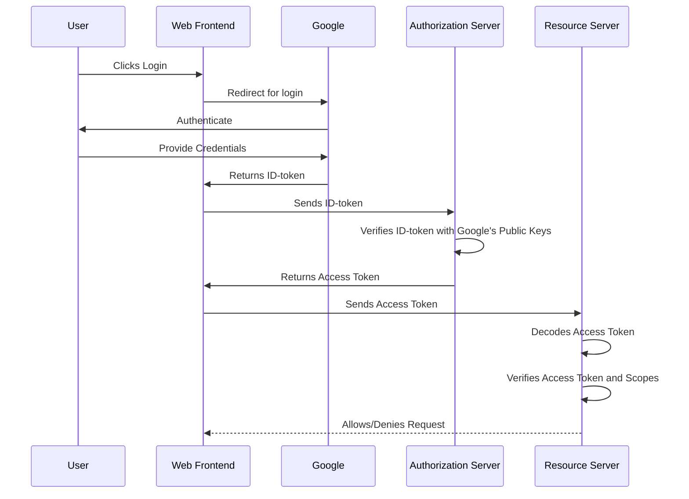

## Sequence Diagram

```mermaid
sequenceDiagram
    participant User
    participant WebFrontend as Web Frontend
    participant Google
    participant AuthServer as Authorization Server
    participant ResourceServer as Resource Server

    User->>WebFrontend: Clicks Login
    WebFrontend->>Google: Redirect for login
    Google->>User: Authenticate
    User->>Google: Provide Credentials
    Google->>WebFrontend: Returns ID-token
    WebFrontend->>AuthServer: Sends ID-token
    AuthServer->>AuthServer: Verifies ID-token with Google's Public Keys
    AuthServer->>WebFrontend: Returns Access Token
    WebFrontend->>ResourceServer: Sends Access Token
    ResourceServer->>ResourceServer: Decodes Access Token
    ResourceServer->>ResourceServer: Verifies Access Token and Scopes
    ResourceServer-->>WebFrontend: Allows/Denies Request
```