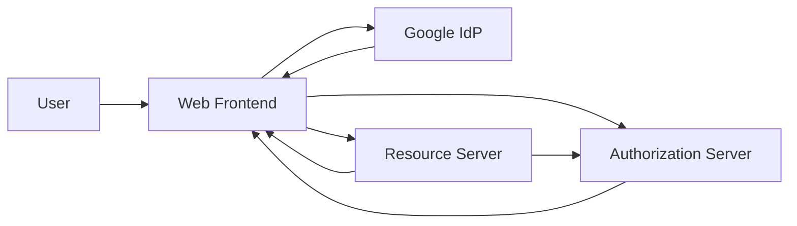
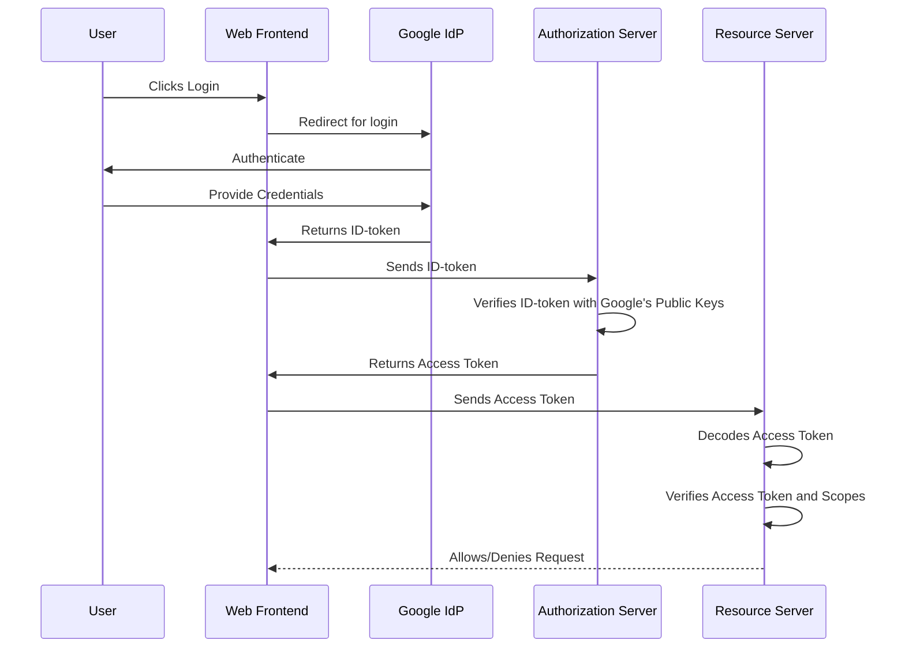

# Architecture

### User 
This refers to the individual who is interacting with the Web Frontend. The user initiates the login process and provides their credentials when redirected to Google for authentication.

### Web Frontend
This is the user interface of your application. It includes a login button that, when clicked, redirects the user to Google for authentication. Once Google authenticates the user, an ID-token is sent back to the Web Frontend. This ID-token is then forwarded to the Authorization Server.

### Google IdP
This component is the identity provider. When a user attempts to login, they are redirected to Google where they provide their credentials. Upon successful authentication, Google generates an ID-token and sends it back to the Web Frontend.

### Authorization Server
This server is responsible for verifying the ID-token received from the Web Frontend. This is done using Google's public keys. If the ID-token is valid, the server maps the ID to the correct permissions, generates an Access Token, and sends this token back to the Web Frontend.

### Resource Server
The Resource Server is the component that handles the requests made by the Web Frontend using the Access Token. It verifies the token by decoding it either independently or by querying the Authorization Server for a decoded token. It also checks the token's freshness and scopes. If everything checks out, the Resource Server allows the requested operation. If not, it returns a 401 Unauthorized response.

These components work together to provide a secure login and authorization process for your application using OAuth 2.0 and OpenID Connect protocols with Google as the identity provider.

## Sequence Diagram
